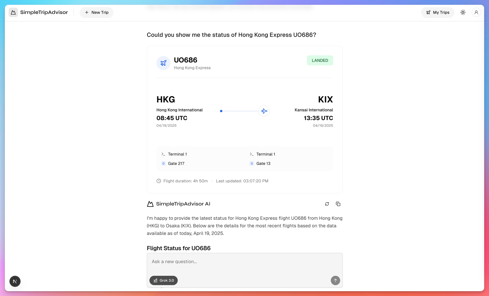

# SimpleTripAdvisor

All-in-one travel assistant that provides Trip planning, AI-powered search, web search, weather information, maps, and flight tracking.
This project is a travel assistant application that utilizes various APIs to provide users with a comprehensive travel planning experience. It includes features such as trip planning, AI-powered search, web search, weather information, maps, and flight tracking.
## Features

### Minimalistic UI
The application has a clean and minimalistic UI, making it easy to navigate and use.
- **Home Page**: The home page provides a simple and intuitive interface for users to start their travel planning.


### Trip planning
Plan your trip using AI recommendations.
- **Trip Planning**: Get AI-generated trip plans based on your preferences.

- **Trip Plan**: View the generated trip plan.


### AI-powered search
Get answers to your questions using grok or gemini.
- **Ask Date and Time**: Ask about the current date and time.


### Weather
Get the current weather for any location using OpenWeather's API.
- **Current Weather**: Get the current weather for a specific location like "Hong Kong".

- **Weather Forecast**: Get the weather forecast for the next 5 days.


### Maps
Get the location of any place using Google Maps API, Mapbox API, and TripAdvisor API.
- **Find places**: Search for places like Ocean Park as an example.

- **View in Fullscreen**: View the map in fullscreen mode.

- **Accurate Location**: Get the accurate location of a place.


### Web search
Search the web using Tavily's API.
- **Search for airlines**: Search for airlines from Hong Kong to Osaka.


### Flight Tracker
Track flights using AviationStack's API.
- **Flight Status**: Get the status of a flight using its flight number (e.g. UO686).


### Suggested Questions Generation

Generate suggested questions based on the user's query using Grok.
- **Suggested Questions**: Get a list of suggested questions based on the user's query.


## Large Language Models
- [xAI's Grok](https://x.ai/grok)
- [Google's Gemini](https://www.ai.dev/)

## Built with
- [Next.js](https://nextjs.org/)
- [Tailwind CSS](https://tailwindcss.com/)
- [Vercel AI SDK](https://sdk.vercel.ai/docs)
- [Shadcn/UI](https://ui.shadcn.com/)
- [Tavily](https://tavily.com/)
- [OpenWeather](https://openweathermap.org/)
- [Google Maps](https://developers.google.com/maps)
- [Mapbox](https://www.mapbox.com/)
- [TripAdvisor](https://www.tripadvisor.com/)
- [AviationStack](https://aviationstack.com/)

### Local development

#### Run via Docker

The application can be run using Docker in two ways:

##### Using Docker Compose (Recommended)

1. Make sure you have Docker and Docker Compose installed on your system
2. Create a `.env.local` file based on `.env.example` with your API keys
3. Run the following command in the project root:
   ```bash
   docker compose up
   ```
4. The application will be available at `http://localhost:3000`

##### Using Docker Directly

1. Create a `.env.local` file based on `.env.example` with your API keys
2. Build the Docker image:
   ```bash
   docker build -t simpletripadvisor.app .
   ```
3. Run the container:
   ```bash
   docker run --env-file .env.local -p 3000:3000 simpletripadvisor.app
   ```

The application uses a multi-stage build process to minimize the final image size and implements security best practices. The production image runs on Node.js LTS with Alpine Linux for a minimal footprint.

#### Run with Node.js

To run the application locally without Docker:

1. Sign up for accounts with the required AI providers:
   - Grok (required)
   - Tavily (required for web search feature)
   - OpenWeather (required for weather feature)
   - Google Maps (required for maps feature)
   - Mapbox (required for maps feature)
   - TripAdvisor (required for maps feature)
   - AviationStack (required for flight tracking feature)
2. Copy `.env.example` to `.env.local` and fill in your API keys
3. Install dependencies:
   ```bash
   pnpm install
   ```
4. Start the development server:
   ```bash
   pnpm dev
   ```
5. Open `http://localhost:3000` in your browser

# License

This project is licensed under the MIT License - see the [LICENSE](LICENSE) file for details.
